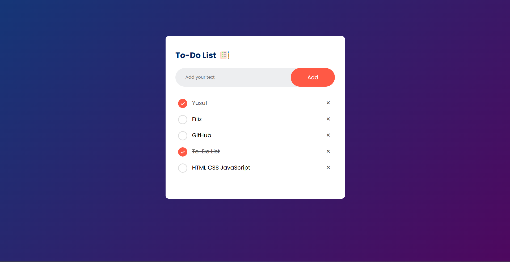

# To-Do List Web App

Bu proje, kullanıcıların görevlerini ekleyebileceği, işaretleyebileceği ve silebileceği basit bir **to-do list uygulamasıdır**. Görevler tarayıcıda **localStorage** kullanılarak kaydedilir, böylece sayfa yenilendiğinde görevler korunur.

## Özellikler

- **Görev Ekleme**: Kullanıcılar giriş kutusuna bir görev yazabilir ve "Add" butonuna tıklayarak listeye ekleyebilir.
- **Görev Tamamlama**: Görevlerin üzerine tıklanarak tamamlandı olarak işaretlenebilir.
- **Görev Silme**: Görevlerin yanındaki çarpı işaretine tıklanarak görevler silinebilir.
- **Veri Saklama**: Görevler, tarayıcıda **localStorage** kullanılarak kaydedilir.

## Kullanılan Teknolojiler

- **HTML**: Yapıyı oluşturmak için kullanıldı.
- **CSS**: Uygulamanın tasarımı için kullanıldı.
- **JavaScript**: Uygulamanın etkileşimlerini sağlamak için kullanıldı.

## Nasıl Kullanılır?

1. Bu projeyi klonlayın:
   ```bash
   git clone https://github.com/yfiliz/todo-list.git
2. Proje dizinine gidin: cd proje-adi

3. index.html dosyasını bir tarayıcıda açın:

## Ekran Görüntüsü



## Yapılacaklar

- Görevlerin öncelik sıralamasını ayarlama.
- Tema desteği ekleme (karanlık/aydınlık mod).
- Görevler için kategori sistemi ekleme.

## Katkıda Bulunun

Katkıda bulunmak isterseniz, lütfen bir **pull request** gönderin veya bir **issue** açın.

## Lisans

Bu proje [MIT Lisansı](LICENSE) altında lisanslanmıştır.
